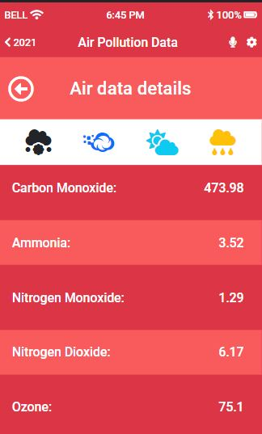

# React & Redux capstone project - Air Pollution Data

> This React capstone project is about building a mobile web application to check a list of metrics (numeric values) that were created by making use of React and Redux. An API ([OpenWeahter](https://openweathermap.org/api/air-pollution)) was chosen to provide numeric data and then build the web app around it. 

### The web app will have several pages:

- One page with a list of items that are filtered by continent, showing its countries.
  
- One page for the item details showing country's air data pollution values **(Ozone, Nitrogen Monoxide, Ammonia, etc).**

## This project was built with:

 - React.

 - Redux for state management.

 - Use Webpack dependencies for better JS and CSS file performance.

 - Bootstrap 5.

 - Font awesome 5.

 - [OpenWeahter](https://openweathermap.org/api/air-pollution) API features.

## Image Preview

## :movie_camera: [Video Presentation](https://www.loom.com/share/037954db38dc420081829a545d258789)

## :star: [Live Demo](https://determined-golick-7cda16.netlify.app) :star:

## Getting Started

To get a local copy up and running follow these simple example steps:

- On the project, GitHub page, navigate to the [main page of the repository](https://github.com/mrigorir/air-pollution-data)

- Click on a button named `code`

- Copy the project URL as displayed on HTTPS tab

- If you're running Windows Operating System, open your command prompt. On Linux, Open your terminal

- Change the current working directory to the location where you want the cloned directory to be made. Leave as it is if the current location is where you want the project to be.

- Type `git clone`, and then paste the URL you copied in Step 3. 

  `$ git clone https://github.com/mrigorir/air-pollution-data.git` <em>Press Enter key</em> 

- Your local copy will be created.

- Please note that you must have Git installed on your PC, this can be done [here](https://gist.github.com/derhuerst/1b15ff4652a867391f03)

- After you get the project aiming to the desired directory, you need now to install dependencies by running npm install.

### Github Actions

To make sure the linters' checks using Github Actions work properly, you should follow the next steps:

1. On your recently forked repo, enable the GitHub Actions in the Actions tab.
   
2. Create the `feature/branch` and push.
   
3. Start working on your milestone as usual.
   
4. Open a PR from the `feature/branch` when your work is done.

### Usage 

- Make sure you have npm and node installed.

- I recommend the use of VS code as a code editor, but you can use any code editor.

- Run in your terminal `npm run start` to see the run the app in your default browser.

- You should see the rockets page as the page loads. 

- Click on the various links in the Navigation bar to Navigate to the different pages. 

## Authors

👤 **Marco Parra**

- GitHub: [@mrigorir](https://github.com/mrigorir)
- Twitter: [@marcoparra311](https://twitter.com/marcoparra311)
- LinkedIn: [@marco-alonso-parra](https://www.linkedin.com/in/marco-alonso-parra/)

## 🤝 Contributing

Contributions, issues, and feature requests are welcome!

Feel free to check the [issues page](https://github.com/mrigorir/air-pollution-data/issues).

## Show your support

Give a ⭐️ if you like this project!

## Acknowledgments

- Special thanks to **[Nelson Sakwa](https://www.behance.net/sakwadesignstudio)** for this amazing **[design!](https://www.behance.net/gallery/31579789/Ballhead-App-(Free-PSDs))**

- Microverse Activities.

- Microverse coding partners. 

## 📝 License

This project is [MIT](https://github.com/mrigorir/air-pollution-data/blob/main/LICENSE) licensed.